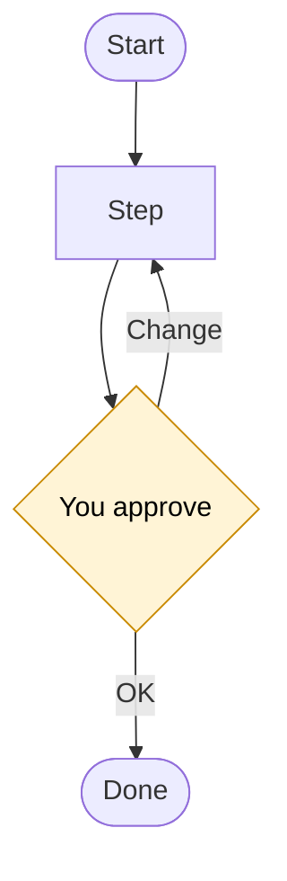

# <Workflow name>

<1–2 sentences of context: when it is used, which command/hook/subagent it involves.>

```mermaid
flowchart TD
    START(["Start"]) --> STEP["Step"]
    STEP --> OK{"You approve"}
    OK -->|"OK"| DONE(["Done"])
    OK -->|"Change"| STEP

    classDef human fill:#fff4d6,stroke:#c98a00,color:#000
    class OK human
```

<Short notes after the diagram if needed.>
