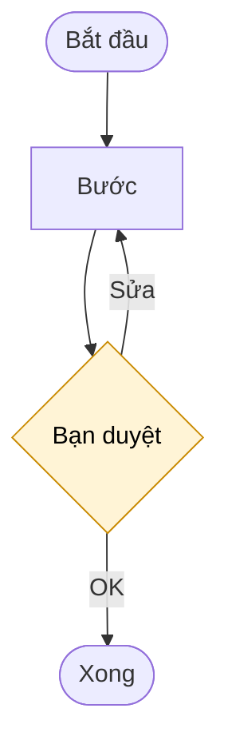

# <Tên quy trình>

<Bối cảnh 1–2 câu: khi nào dùng, liên quan command/hook/subagent nào.>

```mermaid
flowchart TD
    START(["Bắt đầu"]) --> STEP["Bước"]
    STEP --> OK{"Bạn duyệt"}
    OK -->|"OK"| DONE(["Xong"])
    OK -->|"Sửa"| STEP

    classDef human fill:#fff4d6,stroke:#c98a00,color:#000
    class OK human
```

<Ghi chú ngắn sau sơ đồ nếu cần.>
