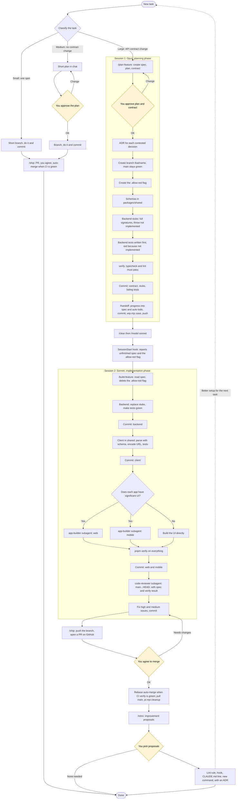

# Overview

```mermaid
flowchart TD
    START(["New task"]) --> TIER{"Classify the task"}

    TIER -->|"Small: one spot"| SMALL["Short branch, do it and commit"]
    TIER -->|"Medium: no contract change"| MED["Short plan in chat"]
    TIER -->|"Large: API contract change"| P1

    MED --> MEDOK{"You approve the plan"}
    MEDOK -->|"OK"| MEDDO["Branch, do it and commit"]
    MEDOK -->|"Change"| MED

    subgraph PHASE1["Session 1: Opus, planning phase"]
        P1["/plan-feature: create spec, plan, contract"] --> APPROVE{"You approve plan and contract"}
        APPROVE -->|"Change"| P1
        APPROVE -->|"OK"| ADR1["ADR for each contested decision"]
        ADR1 --> BR["Create branch feat/name, main stays green"]
        BR --> RED["Create the .allow-red flag"]
        RED --> CONTRACT["Schemas in packages/shared"]
        CONTRACT --> STUB["Backend stubs: full signatures, throw not implemented"]
        STUB --> TESTS["Backend tests written first, red because not implemented"]
        TESTS --> V1["verify: typecheck and lint must pass"]
        V1 --> C1["Commit: contract, stubs, failing tests"]
        C1 --> HO["/handoff: progress into spec and auto todo, commit, wip.mjs save, push"]
    end

    HO --> SWITCH["/clear then /model sonnet"]
    SWITCH --> CTX["SessionStart hook: reports unfinished spec and the .allow-red flag"]
    CTX --> P2

    subgraph PHASE2["Session 2: Sonnet, implementation phase"]
        P2["/build-feature: read spec, delete the .allow-red flag"] --> BE["Backend: replace stubs, make tests green"]
        BE --> C2["Commit: backend"]
        C2 --> CLIENT["Client in shared: parse with schema, encode URL, tests"]
        CLIENT --> C2B["Commit: client"]
        C2B --> UIQ{"Does each app have significant UI?"}
        UIQ -->|"Yes"| WEB["app-builder subagent: web"]
        UIQ -->|"Yes"| MOB["app-builder subagent: mobile"]
        UIQ -->|"No"| INLINE["Build the UI directly"]
        WEB --> JOIN["pnpm verify on everything"]
        MOB --> JOIN
        INLINE --> JOIN
        JOIN --> C3["Commit: web and mobile"]
        C3 --> REV["code-reviewer subagent: main...HEAD, with spec and verify result"]
        REV --> FIX["Fix high and medium issues, commit"]
    end

    FIX --> SHIP["/ship: push the branch, open a PR on GitHub"]
    SHIP --> MERGE{"You agree to merge"}
    MERGE -->|"Needs changes"| FIX
    MERGE -->|"OK"| FF["Rebase auto-merge when CI verify is green; pull main, pr.mjs cleanup"]
    FF --> RETRO["/retro: improvement proposals"]
    RETRO --> PICK{"You pick proposals"}
    PICK --> IMPROVE["Lint rule, hook, CLAUDE.md line, new command, with an ADR"]
    IMPROVE -.->|"Better setup for the next task"| START

    SMALL --> SHIPS["/ship: PR, you agree, auto-merge when CI is green"]
    MEDDO --> SHIPS
    SHIPS --> DONE(["Done"])
    PICK -->|"None needed"| DONE
    IMPROVE --> DONE

    classDef human fill:#fff4d6,stroke:#c98a00,color:#000
    class APPROVE,MEDOK,MERGE,PICK human
```

Yellow boxes are the points where you need to be present. Claude does every other step.
