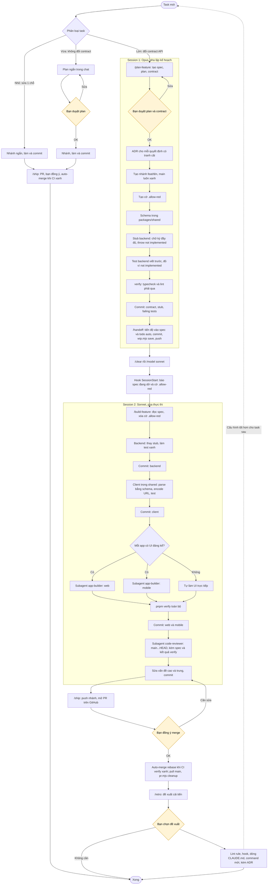

# Tổng quan

```mermaid
flowchart TD
    START(["Task mới"]) --> TIER{"Phân loại task"}

    TIER -->|"Nhỏ: sửa 1 chỗ"| SMALL["Nhánh ngắn, làm và commit"]
    TIER -->|"Vừa: không đổi contract"| MED["Plan ngắn trong chat"]
    TIER -->|"Lớn: đổi contract API"| P1

    MED --> MEDOK{"Bạn duyệt plan"}
    MEDOK -->|"OK"| MEDDO["Nhánh, làm và commit"]
    MEDOK -->|"Sửa"| MED

    subgraph PHASE1["Session 1: Opus, pha lập kế hoạch"]
        P1["/plan-feature: tạo spec, plan, contract"] --> APPROVE{"Bạn duyệt plan và contract"}
        APPROVE -->|"Sửa"| P1
        APPROVE -->|"OK"| ADR1["ADR cho mỗi quyết định có tranh cãi"]
        ADR1 --> BR["Tạo nhánh feat/tên, main luôn xanh"]
        BR --> RED["Tạo cờ .allow-red"]
        RED --> CONTRACT["Schema trong packages/shared"]
        CONTRACT --> STUB["Stub backend: chữ ký đầy đủ, throw not implemented"]
        STUB --> TESTS["Test backend viết trước, đỏ vì not implemented"]
        TESTS --> V1["verify: typecheck và lint phải qua"]
        V1 --> C1["Commit: contract, stub, failing tests"]
        C1 --> HO["/handoff: tiến độ vào spec và todo auto, commit, wip.mjs save, push"]
    end

    HO --> SWITCH["/clear rồi /model sonnet"]
    SWITCH --> CTX["Hook SessionStart: báo spec đang dở và cờ .allow-red"]
    CTX --> P2

    subgraph PHASE2["Session 2: Sonnet, pha thực thi"]
        P2["/build-feature: đọc spec, xóa cờ .allow-red"] --> BE["Backend: thay stub, làm test xanh"]
        BE --> C2["Commit: backend"]
        C2 --> CLIENT["Client trong shared: parse bằng schema, encode URL, test"]
        CLIENT --> C2B["Commit: client"]
        C2B --> UIQ{"Mỗi app có UI đáng kể?"}
        UIQ -->|"Có"| WEB["Subagent app-builder: web"]
        UIQ -->|"Có"| MOB["Subagent app-builder: mobile"]
        UIQ -->|"Không"| INLINE["Tự làm UI trực tiếp"]
        WEB --> JOIN["pnpm verify toàn bộ"]
        MOB --> JOIN
        INLINE --> JOIN
        JOIN --> C3["Commit: web và mobile"]
        C3 --> REV["Subagent code-reviewer: main...HEAD, kèm spec và kết quả verify"]
        REV --> FIX["Sửa vấn đề cao và trung, commit"]
    end

    FIX --> SHIP["/ship: push nhánh, mở PR trên GitHub"]
    SHIP --> MERGE{"Bạn đồng ý merge"}
    MERGE -->|"Cần sửa"| FIX
    MERGE -->|"OK"| FF["Auto-merge rebase khi CI verify xanh; pull main, pr.mjs cleanup"]
    FF --> RETRO["/retro: đề xuất cải tiến"]
    RETRO --> PICK{"Bạn chọn đề xuất"}
    PICK --> IMPROVE["Lint rule, hook, dòng CLAUDE.md, command mới, kèm ADR"]
    IMPROVE -.->|"Cấu hình tốt hơn cho task sau"| START

    SMALL --> SHIPS["/ship: PR, bạn đồng ý, auto-merge khi CI xanh"]
    MEDDO --> SHIPS
    SHIPS --> DONE(["Xong"])
    PICK -->|"Không cần"| DONE
    IMPROVE --> DONE

    classDef human fill:#fff4d6,stroke:#c98a00,color:#000
    class APPROVE,MEDOK,MERGE,PICK human
```

Ô vàng là điểm bạn cần có mặt. Mọi bước khác Claude tự làm.
